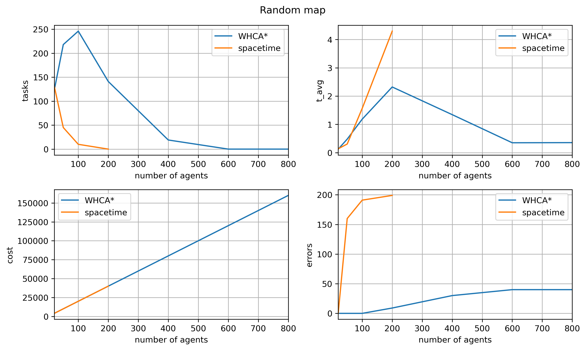
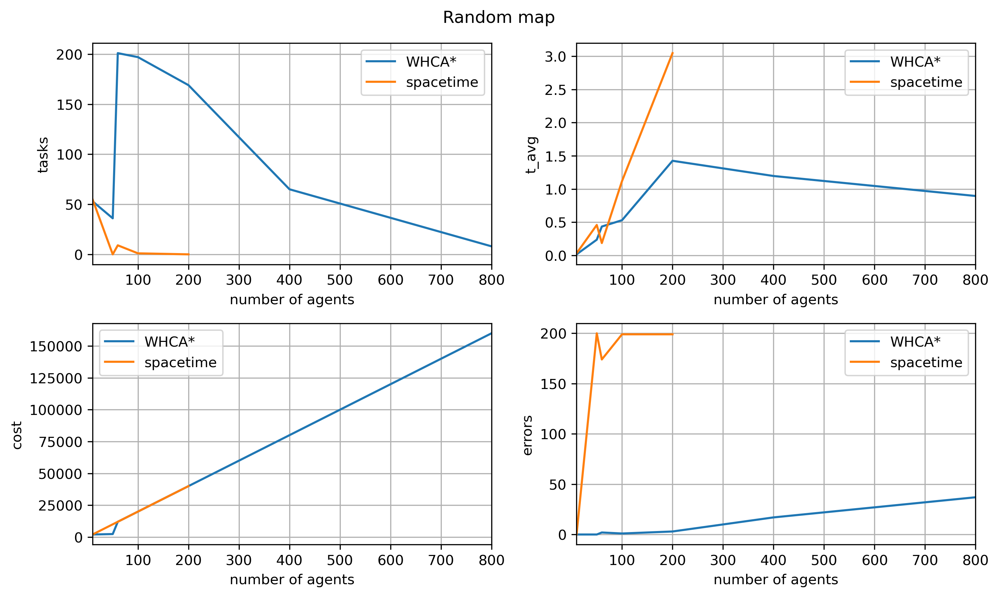

Original repo's readme is located at: [Description.md](./Description.md)

## Project description
The project's goal is to write a path finding algorithm for multiple agents according to rules set by the *leagueofrobotrunners* competition.

The setting is pretty simple, robots are placed on a grid map, and are each given a target location to reach, the goal is to find an optimal control strategy in under $t=1s$. After reaching the target, the robots get a new goal, and the show continues.

Our goal was implementing an algorithm that solves problem of finding paths for multiple agents. The problem is described in detail on competition from which this project is based on ([competition website](http://www.leagueofrobotrunners.org/)). 

### Trying a naive $A^*$ approach
he basic approach was to implement a classic $A^*$ algorithm for each agent independently, and hope It works. \
**Well, it doesn't.**
The problem is when two robots want to go to the same square at the same time, so a collission occurs.

### Avoiding collisions
So we need a planning algorithm that will actually prevent robot's from colliding, for this we need to be able to predict other agent's future locations in our graph search. So we add the time dimension to the state space, hence the idea of space-time space is born.

The planning is conducted for each agent one by one and the planned path is added to the reservation table which hold the position the agent takes at some point in time. Planning for the next agents is conducted with taking this information into consideration, where the first agents to plan, are basically given priority. (since the reservation table is empty at first, so they're able to plan more freely).

The problem is that planning becomes harder as more agents reserve their spots and new agents have a hard time finding path. Also searching the whole space-time graph is very computationally haeavy and doesn't scale well for bigger maps with more agents.

*Solution?*\
$\text{WHCA}^*$

## $\text{WHCA}^*$ overview

So what WHCA* does?\
It also finds the paths for agents using A*.\
It also makes the reservation.\
The main difference is that WHCA* doesn't add all paths to the reservation table. It only add first W places. The number W is choosen arbitraly. Moreover the planned path is only executed for K steps (K is also choosen arbitraly and it is sugessed that K = W/2). After makeing K steps the reservation table is cleared and the algorith plan paths again.\
Our implementation has a few changes in comparison with ther original one:
- when the robot is stuck and doesn't have any valid move, after one step, the path is planned again
- When the robot reaches the goal the planning is conducted again
- reservation is added not only for the current place at this time, but also for the next time step.

The implementation was based on:
- Stern, Roni. (2019). Multi-Agent Path Finding – An Overview. 10.1007/978-3-030-33274-7_6. 
- Z. Bnaya and A. Felner, "Conflict-Oriented Windowed Hierarchical Cooperative A*," 2014 IEEE International Conference on Robotics and Automation (ICRA), Hong Kong, China, 2014, pp. 3743-3748, doi: 10.1109/ICRA.2014.6907401.

## Perforamnce comparison
To compare the performance of the planning policies, we ran a series of benchmarks on provided example problems. We compare performance of two algorithms, WHCA* and complete spacetime priority planner, mentioned earlier.

We use the following metrices:
- $N$ - number of tasks finished
- $t_{max}$ - The longest planning time
- $t_{avg}$ - The average planning time
- $e$ - number of errors (ex. collisions)
- $L$ - sum of costs

There is a clearly visible improvement over spacetime prioritty planner method, basically in every metric. However both algorithms take too much time on bigger maps.

## How to run?
To run the planning software with the visualization software you have to clone this repo and clone the repo that visualize planned paths ([visualizer](https://github.com/MAPF-Competition/PlanViz)).\
../\
|--MULTI-AGENT-PATH-PLANNING-MIAPR-\
|--PlanViz\
These shoud be in the same folder.\
Now within MULTI-AGENT-PATH-PLANNING-MIAPR folder is test.sh file that needs to be run from MULTI-AGENT-PATH-PLANNING-MIAPR 